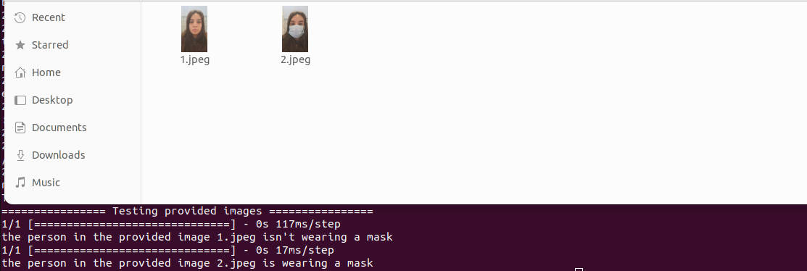

# Face-Mask Detector
Real time face-mask detection using Deep Learning and OpenCV that integrates HiveMQ network in order to exchange data between the provided scripts and our frontend applications.

## About Project
This project is realized by Oumaim Souli for educational purpose. It uses Deep Neural Network through OpenCV to differentiate between people with and without masks, then sends the result to the HiveMQ network in order to be integrated with our web and mobile applications.
Our project contains 3 major files:
- train.py used for training the model based on the provdided dataset (our model will be generated under the name of model.h5)
- static-images.py used to test the model based on the provided images of me, Oumaima Souli. The result should be as mentionned in the provided POC.
- live-detection.py is our main project file, it analyze the captured frames from the webcam, in real time, preprocess and fed them to the model in order to accomplish the prediction task, then sends each result to the HiveMQ network in order to be processed by our web/mobile application.
The model works efficiently with no apparent lag time between wearing/removing mask and display of prediction.

#### The model is capable of predicting multiple faces with or without masks at the same time

## Proof-of-concept 





## Dataset

For better prediction we used the dataset provided in [link](https://data-flair.training/blogs/download-face-mask-data/) that can be downloaded from the link or this repository as well (folders 'test' and 'train'). There are 1314 training images and 194 test images divided into two catgories, with and without mask.

## How to Use

To run this project, follow these steps:

**1. Clone this repository onto your system by typing the following command on your Command Prompt:**

```
git clone https://github.com/Meysouli/Face-Mask-Detector.git
```
followed by:

```
cd FaceMaskDetector
```

**2. Download all libaries using:**
```
pip install -r requirements.txt
```

**3. Run train.py in order to train the model by typing the following command (model.h5 will be generated):**
```
python train.py 
```
or 
```
python3 train.py 
```
**4. Run static-image.py to verify if the project is working correctly:**
```
python3 static-image.py 
```
The provided script will start analyzing the provided images of me, Oumaima Souli. It will show the results as provided in the POC.

**5. Start the live detection**

```
python3 live_detection.py 
```
The provided script will establish as first a secure TLS connection to the HiveMQ network through out my provided credentials, it will load the trained model, start capturing and analyzing the live video, and send a True in case the person in the video is wearing a mask, otherwise a False will be sent.


#### Realised by Oumaima Souli

